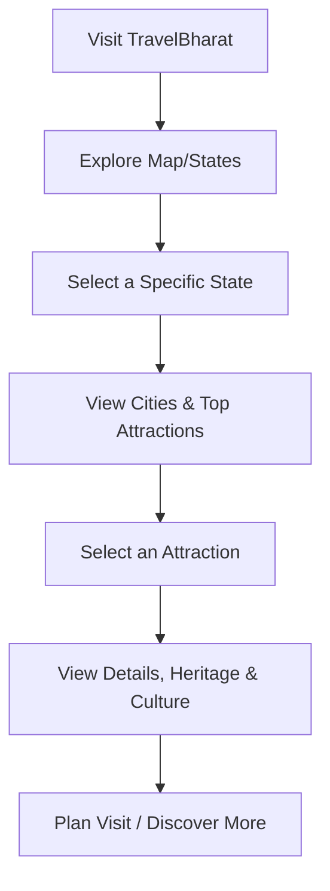
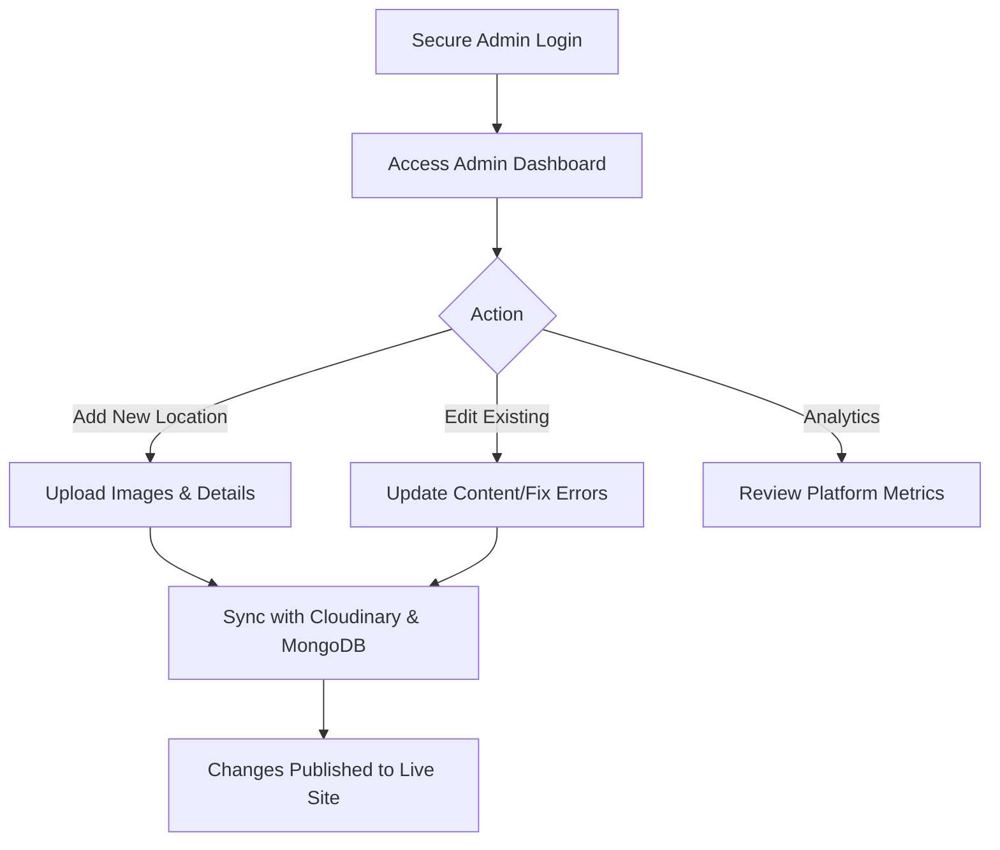

# 🌍 TravelBharat

**TravelBharat** is a premium, full-stack tourism information and exploration platform. It provides a comprehensive and visually engaging experience for travelers to discover India state-by-state, featuring detailed insights into cities, heritage sites, local culture, and top tourist attractions. The platform offers seamless navigation, curated travel content, and a reliable ecosystem for exploring the beauty of India.

---

## 📑 Table of Contents
1. [Platform Overview](#-platform-overview)
2. [Key Features](#-key-features)
3. [User Flows](#-user-flows)
4. [Project & System Flow](#-project--system-flow)
5. [Technology Stack](#-technology-stack)
6. [Getting Started](#-getting-started)
7. [Architecture & Structure](#-architecture--structure)

---

## 🌟 Platform Overview

TravelBharat operates on a **Dual-role Architecture**, providing tailored, secure environments for two distinct user types:
1. **User (Traveler/Tourist):** Explore destinations, discover hidden gems, plan trips, and interact with the platform.
2. **Admin (Operations):** Oversee platform health, manage destination content, update city information, and curate high-quality imagery.

---

## ✨ Key Features

### 🗺️ Traveler Experience
* **Intelligent Discovery:** Browse destinations categorized logically by state and city.
* **Rich Media Content:** View high-resolution image galleries and immersive descriptions of tourist attractions.
* **Culture & Heritage Insights:** Dedicated sections detailing local history, cuisine, and cultural significance.
* **Responsive Navigation:** A fluid, mobile-first interface optimized for fast and seamless browsing.

### 🛡️ Admin Control Center
* **Content Management System (CMS):** Add, update, and manage details for states, cities, and specific landmarks.
* **Media Management:** Direct integration with Cloudinary for secure and optimized image uploads.
* **System Analytics:** Monitor platform traffic, user engagement, and popular destination metrics.
* **Data Integrity:** Ensure all public information is accurate and up to date through a centralized dashboard.

---

## 🗺️ User Flows

### 1. The Explorer's Journey (User Flow)


### 2. Content Management Journey (Admin Flow)


---

## ⚙️ Project & System Flow

### System Architecture
TravelBharat utilizes a decoupled Client-Server architecture. The frontend is an interactive Single Page Application (SPA) built with React and Vite that communicates with a RESTful Node.js backend via JSON payloads, secured by strict CORS policies and rate limiting.

### Media & Content Delivery Flow
To ensure fast load times and high-quality imagery:
1. **Upload:** Admins upload location images via the secure dashboard.
2. **Processing:** Images are processed through `multer` and instantly uploaded to **Cloudinary**.
3. **Storage:** Only the optimized Cloudinary URLs are stored in the MongoDB database, minimizing database size and maximizing frontend rendering speeds.

### Data Security & Validation
The backend employs strict middleware security layers:
* `helmet`: Secures Express apps by setting various HTTP headers.
* `express-mongo-sanitize`: Prevents MongoDB Operator Injection.
* **Rate Limiting:** Protects the API from brute-force and DDoS attacks.
* **Schema Validation:** Mongoose schemas enforce strict data typing to maintain accurate and reliable destination data.

---

## 🛠️ Technology Stack

**Frontend (Client)**
* **Core:** React 18, Vite
* **Styling:** Tailwind CSS, Framer Motion (for premium, hardware-accelerated animations)
* **Routing:** React Router DOM
* **State & API:** React Query (@tanstack/react-query), Axios
* **Data Visualization/Carousels:** Recharts, Swiper

**Backend (Server)**
* **Core:** Node.js, Express.js
* **Database:** MongoDB, Mongoose ODM
* **Authentication:** JSON Web Tokens (JWT), bcrypt.js, Firebase Admin
* **Media Storage:** Cloudinary, Multer
* **Security:** Helmet, Express Rate Limit, CORS, Data Sanitization

---

## 🚀 Getting Started

### Prerequisites
* [Node.js](https://nodejs.org/en/download/) (v18+)
* [MongoDB](https://www.mongodb.com/try/download/community) (Local instance or MongoDB Atlas URI)
* [Git](https://git-scm.com/)
* [Cloudinary Account](https://cloudinary.com/) (for image handling)

### 1. Clone the Repository
```bash
git clone https://github.com/FenilKhatri/TravelBharat.git
cd TravelBharat
```

### 2. Backend Setup
```bash
cd travelbharat-backend
npm install
```
Create a `.env` file in the `travelbharat-backend` directory:
```env
PORT=5000
NODE_ENV=development
MONGO_URI=your_mongodb_connection_string
JWT_SECRET=your_jwt_secret_key
FRONTEND_URL=http://localhost:5173
CLOUDINARY_CLOUD_NAME=your_cloud_name
CLOUDINARY_API_KEY=your_api_key
CLOUDINARY_API_SECRET=your_api_secret
```
Start the backend server:
```bash
npm run dev
```

### 3. Frontend Setup
Open a new terminal window:
```bash
cd travelbharat-frontend
npm install
```
Create a `.env` file in the `travelbharat-frontend` directory:
```env
VITE_API_BASE_URL=http://localhost:5000/api
```
Start the frontend application:
```bash
npm run dev
```

The frontend will be available at `http://localhost:5173` and the backend at `http://localhost:5000`.

---

## 📁 Architecture & Structure

The codebase is modular, separating frontend UI components from backend routing and logic.

### Backend (`/travelbharat-backend`)
* `/routes` - Contains the API endpoints for authentication, locations, and admin actions.
* `/common` - Shared utilities and middleware (e.g., rate limiters).
* `/modules` - Domain-specific logic, controllers, and Mongoose Models.
* `/config` - Database and third-party service connections.

### Frontend (`/travelbharat-frontend/src`)
* `/components` - Reusable UI elements (buttons, cards, modals).
* `/features` - Encapsulated domain-specific logic and views.
* `/context` - Global state management providers.
* `/layout` - Structural components like headers, footers, and sidebars.
* `/animations` - Framer Motion configurations for smooth page transitions.

---

## 🤝 Contributing
1. Fork the repository
2. Create your feature branch (`git checkout -b feature/AmazingDestination`)
3. Commit your changes (`git commit -m 'Add AmazingDestination'`)
4. Push to the branch (`git push origin feature/AmazingDestination`)
5. Open a Pull Request

---

## 📄 License
This project is proprietary and built specifically for the Unified Mentorship program. All rights reserved.
